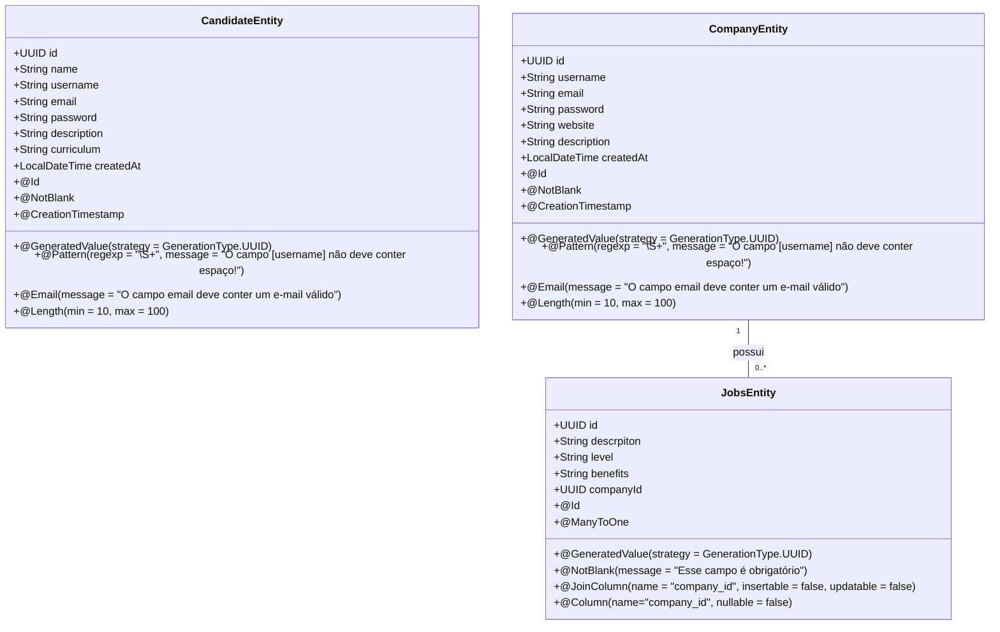

#Diagrama de Classes 

```mermaid
classDiagram
    class CandidateEntity {
        +UUID id
        +String name
        +String username
        +String email
        +String password
        +String description
        +String curriculum
        +LocalDateTime createdAt
    }
    
    CandidateEntity : +@Id
    CandidateEntity : +@GeneratedValue(strategy = GenerationType.UUID)
    CandidateEntity : +@NotBlank
    CandidateEntity : +@Pattern(regexp = "\\S+", message = "O campo [username] não deve conter espaço!")
    CandidateEntity : +@Email(message = "O campo email deve conter um e-mail válido")
    CandidateEntity : +@Length(min = 10, max = 100)
    CandidateEntity : +@CreationTimestamp

    class CompanyEntity {
        +UUID id
        +String username
        +String email
        +String password
        +String website
        +String description
        +LocalDateTime createdAt
    }

    CompanyEntity : +@Id
    CompanyEntity : +@GeneratedValue(strategy = GenerationType.UUID)
    CompanyEntity : +@NotBlank
    CompanyEntity : +@Pattern(regexp = "\\S+", message = "O campo [username] não deve conter espaço!")
    CompanyEntity : +@Email(message = "O campo email deve conter um e-mail válido")
    CompanyEntity : +@Length(min = 10, max = 100)
    CompanyEntity : +@CreationTimestamp

    class JobsEntity {
        +UUID id
        +String descrpiton
        +String level
        +String benefits
        +UUID companyId
    }

    JobsEntity : +@Id
    JobsEntity : +@GeneratedValue(strategy = GenerationType.UUID)
    JobsEntity : +@NotBlank(message = "Esse campo é obrigatório")
    JobsEntity : +@ManyToOne
    JobsEntity : +@JoinColumn(name = "company_id", insertable = false, updatable = false)
    JobsEntity : +@Column(name="company_id", nullable = false)

    CompanyEntity "1" -- "0..*" JobsEntity : possui

```
